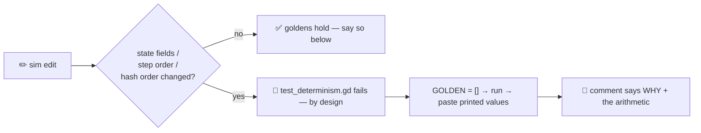

<!--
Thanks for the PR! 🙌 Keep it small, keep it tested, and keep the sim deterministic.
Fill in every section — delete nothing, mark N/A where a box doesn't apply.
-->

## 🎯 Summary

<!-- What does this change, and why? One or two sentences, not a changelog. -->

**Linked issue:** #

## 🧪 Verification

<!-- Every box is real and greppable — CI is the backstop, you are the first check. -->

- [ ] `tools/run_tests.sh` — full suite green **locally** (not just CI)
- [ ] Touched `src/sim/` → `tools/run_tests.sh -s res://tools/lint_sim.gd` is clean (no floats, no `randi()`, no `Time.*`, no scene-tree access)
- [ ] Sim behavior changed → `tests/test_determinism.gd` `GOLDEN` re-recorded with a **why** comment (never re-recorded just to turn a red green)
- [ ] Added `main.<x>` reads in `src/view/menu.gd` / `src/view/hud.gd` → the hand-written `main` stubs in the tests got the same field (stub parity — a missing field makes rows measure ABSENT while tests still pass)
- [ ] Touched `assets/` → re-ran `godot --headless --path . --import` and committed the `.import` sidecars
- [ ] `project.godot` has **no** `addons/` references (no dev-autoload lines snuck in)
- [ ] Docs updated in this same commit if behavior, CLI, or architecture moved
- [ ] No AI attribution anywhere — no "generated with", no Co-Authored-By trailers

🧨 <b>Determinism impact</b> — required if you touched <code>src/sim/</code>

<!-- Does this change sim state, step order, or what checksum() hashes? If yes, explain the intent here. -->

## 📸 Screenshots

<!-- View changes (src/main.gd, src/view/, HUD, menus, art) — drop before/after frames.
     Sim-only changes: write "N/A — sim-only". -->

---

🏃‍♂️ Suite stalling? Check `ps aux | grep -c '[G]odot'` first — a "hanging" suite is CPU contention or a cold import, never a slow test. `pkill -f Godot`, `--import` once, run ONE.
