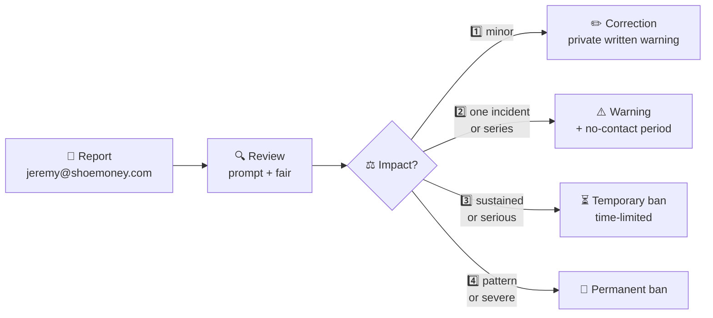

# 🤝 Code of Conduct

> **Be excellent to each other — and to the sim.** This is a tiny project with a
> deterministic heart; the community around it should be just as orderly.

This project follows the spirit and substance of the **Contributor Covenant v2.1** —
restructured to read like the rest of our docs, but with **zero weakening of the rules**.
The full legal-style source is credited at the [bottom](#-attribution). 📜

---

## 🕊️ Our Pledge

We as members, contributors, and leaders pledge to make participation in our
community a **harassment-free experience for everyone**, regardless of age, body
size, visible or invisible disability, ethnicity, sex characteristics, gender
identity and expression, level of experience, education, socio-economic status,
nationality, personal appearance, race, caste, color, religion, or sexual identity
and orientation.

We pledge to act and interact in ways that contribute to an **open, welcoming,
diverse, inclusive, and healthy community**. 🌈

---

## 📏 Our Standards

| ✅ Be excellent — examples of behavior that builds this place | 🚫 No-go — unacceptable behavior |
|---|---|
| 💛 Demonstrating empathy and kindness toward other people | 🔞 The use of sexualized language or imagery, and sexual attention or advances of any kind |
| 🧠 Being respectful of differing opinions, viewpoints, and experiences | 🧌 Trolling, insulting or derogatory comments, and personal or political attacks |
| 🎁 Giving and gracefully accepting constructive feedback | 📢 Public or private harassment |
| 🙇 Accepting responsibility and apologizing to those affected by our mistakes, and learning from the experience | 🕵️ Publishing others' private information, such as a physical or email address, without their explicit permission |
| 🌐 Focusing on what is best not just for us as individuals, but for the overall community | 💼 Other conduct which could reasonably be considered inappropriate in a professional setting |

---

## 🧭 Enforcement Responsibilities

Community leaders are responsible for **clarifying and enforcing** our standards of
acceptable behavior and will take **appropriate and fair corrective action** in
response to any behavior that they deem inappropriate, threatening, offensive, or
harmful. ⚖️

Community leaders have the **right and responsibility** to remove, edit, or reject
comments, commits, code, wiki edits, issues, and other contributions that are not
aligned to this Code of Conduct, and will **communicate reasons** for moderation
decisions when appropriate. 🧹

---

## 🌍 Scope

This Code of Conduct applies within **all community spaces** — issues, pull
requests, discussions, code review — and also applies when an individual is
**officially representing the community in public spaces**. Examples of
representing our community include using an official e-mail address, posting via
an official social media account, or acting as an appointed representative at an
online or offline event. 🎪

---

## 🚨 Enforcement

Instances of abusive, harassing, or otherwise unacceptable behavior may be
reported to the community leaders responsible for enforcement at
**[📮 jeremy@shoemoney.com](mailto:jeremy@shoemoney.com)**.

All complaints will be **reviewed and investigated promptly and fairly**, and all
community leaders are obligated to **respect the privacy and security of the
reporter** of any incident. 🔒

The action ladder, in faithful detail:

### 🔒 Enforcement Guidelines

Community leaders will follow these Community Impact Guidelines in determining
the consequences for any action they deem in violation of this Code of Conduct:

| 🪜 | 💥 Community Impact | 🧾 Consequence |
|---|---|---|
| **1. ✏️ Correction** | Use of inappropriate language or other behavior deemed unprofessional or unwelcome in the community. | A **private, written warning** from community leaders, providing clarity around the nature of the violation and an explanation of why the behavior was inappropriate. A public apology may be requested. |
| **2. ⚠️ Warning** | A violation through a **single incident or series** of actions. | A **warning with consequences for continued behavior**. No interaction with the people involved, including unsolicited interaction with those enforcing the Code of Conduct, for a specified period of time. This includes avoiding interactions in community spaces as well as external channels like social media. Violating these terms may lead to a temporary or permanent ban. |
| **3. ⏳ Temporary Ban** | A **serious violation** of community standards, including sustained inappropriate behavior. | A **temporary ban** from any sort of interaction or public communication with the community for a specified period of time. No public or private interaction with the people involved, including unsolicited interaction with those enforcing the Code of Conduct, is allowed during this period. Violating these terms may lead to a permanent ban. |
| **4. 🚫 Permanent Ban** | Demonstrating a **pattern of violation** of community standards, including sustained inappropriate behavior, harassment of an individual, or aggression toward or disparagement of classes of individuals. | A **permanent ban** from any sort of public interaction within the community. |

---

## 📮 Reporting

- 📧 **Where:** [jeremy@shoemoney.com](mailto:jeremy@shoemoney.com)
- 🧾 **What helps:** what happened, where (issue/PR/discussion), links or screenshots if you have them, and whether it's ongoing.
- 🤐 **Confidentiality:** reports are handled privately. The reporter's identity and details are not shared beyond the people investigating, and retaliation against a reporter is itself a violation.

For **security vulnerabilities** specifically, don't open a public issue — email the
same address and it gets handled privately too. 🛡️

---

## 📜 Attribution

⚖️ <b>Contributor Covenant v2.1 — source & license</b>

This Code of Conduct is adapted from the
[Contributor Covenant](https://www.contributor-covenant.org/), **version 2.1**,
available at
[contributor-covenant.org/version/2/1/code_of_conduct/](https://www.contributor-covenant.org/version/2/1/code_of_conduct/).

Community Impact Guidelines were inspired by
[Mozilla's code of conduct enforcement ladder](https://github.com/mozilla/inclusion).

For answers to common questions about this code of conduct, see the FAQ at
[contributor-covenant.org/faq](https://www.contributor-covenant.org/faq).
Translations are available at
[contributor-covenant.org/translations](https://www.contributor-covenant.org/translations).

---

**⚔️ Fight the enemy in the field, not each other in the issues. ⚔️**

*Be kind, be deterministic, feed the War Chest.* 💰

