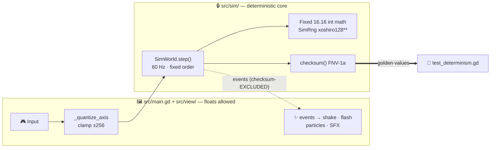
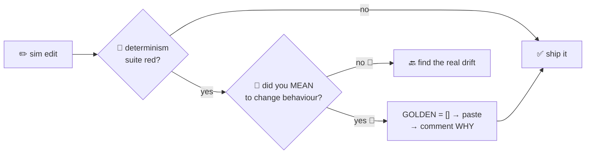
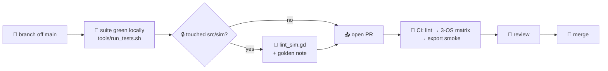

# 🤝 Contributing to Commander In Chief

> Welcome aboard, soldier. 🫡 This is the deep contributor guide — [README.md](README.md)
> has the two-minute version; this file has the part that saves you three evenings.


---

## 🎯 Ways to Contribute

| 🎖️ Lane | 🧰 What it looks like | 📍 Where to start |
|---|---|---|
| 🐛 **Bugs** | Repro steps + a failing test that pins them | [`FINDINGS.md`](FINDINGS.md) — the open defect inventory, each entry adversarially verified with a measured rate |
| ✨ **Features** | Sim change + golden re-record note, or view-only juice | [`Backlog.md`](Backlog.md) — but check the sim code first; the plan is aspirational, the code is truth |
| 🎨 **Art** | Procedural sprites via `tools/gen_*.py`, provenance recorded | [`ASSETS.md`](ASSETS.md) — the per-directory provenance table |
| 🧪 **Tests** | New behaviour brings a check that **fails first** | `tests/test_*.gd` — plain `RefCounted` suites, no addon |
| 📝 **Docs** | Fix drift the moment you see it — stale docs are lying | This file, `README.md`, `DECISIONS.md` |

> 🔎 **Read `FINDINGS.md`'s header before picking a bug**: last re-check, **62 of 115
> findings had already died on their own**. Verify against the code before you fix a ghost.

---

## 🚀 Dev Setup

| # | 🪜 Step | 💻 Command |
|---|---|---|
| 1️⃣ | **Install Godot 4.7.1-stable** (standard, not .NET) — pinned in [`tools/versions.lock`](tools/versions.lock) | <https://godotengine.org/download> |
| 2️⃣ | Clone | `git clone https://github.com/shoemoney/commander-in-chief.git` |
| 3️⃣ | **Import assets — once, mandatory** (also after pulling any new `class_name` script) | `godot --headless --path . --import` |
| 4️⃣ | Play it | `godot --path .` — or open the editor |
| 5️⃣ | Run the full suite (~23 s) | `tools/run_tests.sh` |

Skip step 3 and your first run looks "hung" — it's actually a several-minute cold import.
More on that in the [stall table](#-the-three-stalls--a-hanging-suite-is-never-a-slow-test) below. 🕳️

<details>
<summary>🎮 <b>In-game dev hotkeys</b></summary>

| ⌨️ Key | 🪄 What it does |
|---|---|
| `F2` | Toggle 2-player |
| `F3` | Toggle Endless War mode |
| `R` | Restart |

`main.gd` hard-codes the seed `0xC0FFEE`; modes are `"campaign"`, `"arcade"`, `"endless"` and `"boss_rush"`.

</details>

---

## 🧠 The Sim/View Split — Read This Before Touching Code

Everything the game *is* lives in a deterministic, render-free core. The scene tree is
just a camera pointed at it. 📽️



- 🔒 **`src/sim/`** — `SimWorld.step(inputs)` advances one tick: players → tanks →
  projectiles → enemies → bunkers → spawner/boss/colossus/gates/camera/observer.
  State is plain `Array[Dictionary]`. Bit-identical across x86_64 and Apple Silicon.
- 🖼️ **`src/main.gd` + `src/view/art.gd`** — the *only* view. Owns every float, reads
  sim state, draws, and turns per-tick events into feel.
- 🔓 **`SimWorld.events`** — rebuilt every tick, **excluded from the checksum** — juice
  never breaks determinism.

### 📜 The Determinism Commandments (inside `src/sim/`)

| 🚫 / ✅ | Rule | 🛡️ Enforced by |
|---|---|---|
| 🚫 | No floats | `tools/lint_sim.gd` (CI lint job) |
| 🚫 | No engine RNG (`randi`/`randf`) — use `SimRng` | `tools/lint_sim.gd` |
| 🚫 | No `Time.*` | `tools/lint_sim.gd` |
| 🚫 | No scene-tree access | `tools/lint_sim.gd` |
| ✅ | Multiply/divide fixed-point via `Fixed.mul` / `Fixed.div`, never `*`/`/` directly | convention + code review |
| ✅ | Constants suffixed `_TICKS` / `_RAW` are plain ints, not fixed-point | naming convention |

> ⚠️ **The lint is NOT part of the test suite** — CI runs it as a separate job. After any
> sim edit, run it yourself: `tools/run_tests.sh -s res://tools/lint_sim.gd` 🧹

---

## 🧪 Testing

The suite runs in ~23 s. **Do not trust any method/assertion count written down here** — it grows
constantly, and this line has already gone stale twice. `tools/run_tests.sh` prints the exact pair
on its `PASS —` line; that is the only number worth quoting. To count methods without launching
Godot: `grep -hcE '^func test_' tests/test_*.gd`, then subtract `test_perf.gd`'s methods, since perf
is opt-in and excluded from the default run. Suites are
plain `RefCounted` classes whose `test_*` methods assert via the runner's `T.ok`/`T.eq` —
no GUT addon.

```sh
tools/run_tests.sh                        # 🧪 full suite, private user://
SUITE=mechanics tools/run_tests.sh        # 🔍 one suite (substring of filename)
tools/run_tests.sh -s res://tools/lint_sim.gd     # 🧹 determinism lint
tools/run_tests.sh -s res://tools/smoke.gd        # 🥾 boot smoke
```

> 🏠 **Use `tools/run_tests.sh`, not raw `godot`, whenever anything else might be
> running.** Every parallel run shares one `user://` (keyed on project name, not path),
> and concurrent runs corrupt each other's logs and save fixtures. The wrapper gives
> each run a private `HOME`.

### 🐀 The Two Ratchets (don't neuter either)

| 🐀 Ratchet | 😱 The failure it killed | 🫵 Your job |
|---|---|---|
| **Engine-error gate** | The suite printed ~400 Godot `ERROR:` lines while reporting PASS | Any un-allowlisted `ERROR:` fails the run. Fix the cause — `ERROR_ALLOW` is kept deliberately near-empty (today: one narrow entry for the deliberately-corrupt-config fixture); a new entry needs a written justification in the code, not just a red run |
| **Stub parity** (`tests/test_stub_parity.gd`) | A missing `main.<x>` field aborts the reading call, the row measures ABSENT, and every assertion still passes | Every `main.` read in `src/view/menu.gd` or `hud.gd` must exist on the hand-written `main` stubs |
| **Golden checksum** (`tests/test_determinism.gd`) | Silent determinism drift | See the re-record procedure below |
| **New behaviour, red first** | Checks that pin nothing | Watch the test go red for the *stated reason* before writing the fix |

### 🥇 Re-recording golden checksums — deliberately, never to make red go green

Any change to sim logic, state fields, or hash/step order **will** move the committed
`GOLDEN` values and fail `test_determinism.gd` — by design. When the change is intentional:

1. Set `GOLDEN = []` in `tests/test_determinism.gd` — the test prints the new values.
2. Run the suite, paste the printed values back.
3. Add a comment saying **why** (see the existing P3 re-record note for the format).
4. If you added a sim field that affects gameplay, add it to `checksum()` too —
   `test_checksum_coverage.gd` is the tripwire. 🪤



### 🥶 The Three Stalls — a "hanging" suite is never a slow test

The full suite is ~23 s and a healthy headless run is **CPU-bound**. Low CPU means broken,
never slow. Diagnose by process count and CPU:

| 🧊 Stall | 🔬 Symptom | 🩺 The tell | 🚑 Fix |
|---|---|---|---|
| **CPU contention** | Many Godot procs, each starved (<1% CPU) | `ps aux \| grep -c '[G]odot'` > 1 | `pkill -f Godot`, run ONE |
| **Cold import** | One proc, ~idle, no output, minutes long | Fresh clone/worktree has no `.godot/` | `godot --headless --path . --import` first |
| **Aborted script** | One proc, ~1% CPU, `.godot/` present, no output, forever | An `_init` error killed the script before it installed a main loop | Read the script's own stdout/stderr for the error |

<details>
<summary>🗜️ <b>Bonus trap: the warm-but-STALE <code>.godot</code> cache</b></summary>

`Art.tex()` reads `.godot/imported/*.ctex`, not the PNG on disk. After merging or
regenerating art, a stale cache serves **old pixels** — and an art test then fails while
the working tree is perfectly correct, accusing the wrong thing. Before touching an asset
a test complains about: compare the `.ctex` mtime against the PNG's and re-run
`godot --headless --path . --import`. It's cheap; run it after ANY merge touching
`assets/`. 🎨

</details>

---

## 📦 The PR Process



### ✅ PR checklist

- [ ] 🧪 Full suite green locally via `tools/run_tests.sh` (CI is the backstop, not the first check)
- [ ] 🧹 `lint_sim.gd` run and clean if `src/sim/` changed
- [ ] 🥇 Golden re-record comment explains **why**, with the arithmetic, if checksums moved
- [ ] 🔴 New behaviour has a test that was watched failing first
- [ ] 🚫 No `addons/` line snuck back into `project.godot` (dev-only autoloads must never ship — `test_assets.gd` fails on any reference)
- [ ] 📝 Affected docs updated in the **same commit** (see the docs rule below)
- [ ] 💬 Conventional commit style with emoji (see below)

**What CI will do with it** ([`.github/workflows/ci.yml`](.github/workflows/ci.yml)):
`lint` job (`lint_sim` + `lint_assets`) → 3-OS matrix (**linux-x86_64 · macos-arm64 ·
windows-x86_64**) running boot-smoke (greps the `SMOKE OK` sentinel *and* fails on any
`SCRIPT ERROR`) + the full golden suite → export-smoke on Linux and Windows → advisory
perf (`continue-on-error`). Nightly: a 3-hour soak. The Godot version comes from
`tools/versions.lock`, so CI can't drift from what the goldens were recorded against. 📌

---

## 🎨 Art Contributions

- 🛠️ Owned art is **procedural**: regenerate with `tools/gen_entities.py`,
  `gen_ui_chrome.py`, `gen_ui_icons.py`, `gen_ui_glyphs.py`, `gen_fx_cards.py` — plus
  bespoke generated boss/vehicle/desert pieces.
- 📎 Every PNG needs its committed **`.import` sidecar** — `tools/lint_assets.gd` fails CI
  without it.
- 🗺️ Record provenance in [`ASSETS.md`](ASSETS.md) — the per-directory provenance table
  is what keeps the repo cleanly open-source.
- 🆓 `assets/cc0/` is the Kenney CC0 FX base; `assets/vo/` is synthesized voice —
  read [`NOTICE.md`](NOTICE.md) before touching VO.

---

## 📝 The Docs Rule

Docs drift is lying. 🤥 If your change alters behaviour, commands, counts, or controls,
update the affected `.md` in the **same commit** — README, this file, `DECISIONS.md`,
`FINDINGS.md`, whatever your diff touches. Test counts always carry an "as of" date, or
better, a live `grep` command the reader can run.

---

## 💬 Commit Style

Conventional prefixes + emoji, liberally — straight from the log:

```
fix: 🪟 CI was RED on Windows, and GitHub could not detect the licence
fix: 🧟 the whole army froze while you were down
docs: 🗺️ README gains Roadmap, Contributing and License
chore: 🧼 strip every vendor and infra fingerprint from the public tree
```

`feat:` · `fix:` · `refactor:` · `docs:` · `test:` · `chore:` — small commits beat
sweeping ones, especially on `main.gd`/`art.gd` where parallel work collides.

---

## ⚖️ License

The code is **MIT** ([`LICENSE`](LICENSE)) — by contributing, you agree your contributions
are licensed under MIT. Note that MIT covers the **code only**: bundled assets have their
own provenance and terms in [`ASSETS.md`](ASSETS.md) and [`NOTICE.md`](NOTICE.md).

## 💬 Questions?

- 🐛 Bugs & features: [open an issue](https://github.com/shoemoney/commander-in-chief/issues)
- 📖 The field manual: [`CLAUDE.md`](CLAUDE.md) — hard-won gotchas, each of which once cost someone an hour
- 📧 Anything else: jeremy@shoemoney.com

---

> 🫡 *The sim is deterministic; your welcome here is not — it's guaranteed. See you in the commit log.* ⚔️
