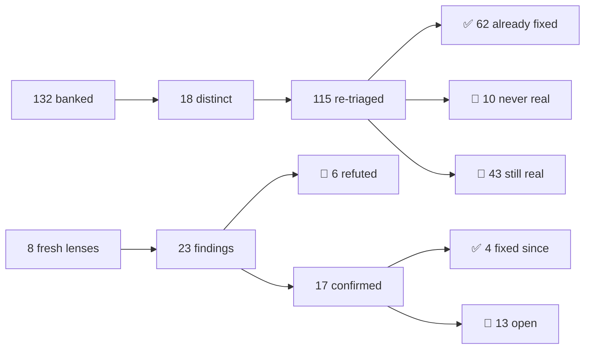

# 🔎 FINDINGS — open defect inventory

  

> ⚠️ **A findings file rots faster than the code it describes.** Re-triaged **2026-07-28**
> against a `main` that had moved 46 commits: **62 of 115 banked findings were already fixed**,
> most from a different angle than the one proposed. Four more were fixed the same day this
> file was regenerated. **Re-check before you plan — no row here is a work order.**

## 📊 Where the numbers went

| | Count | Meaning |
|---|---|---|
| ✅ | **62** | Fixed before the re-triage. Gone, not listed |
| ✅ | **4** | Fixed *after* the sweep — see the resolved table below |
| 🚫 | **10** | Never reproduced. Deliberately not re-opened |
| 🚫 | **6** | Fresh findings the skeptics refuted |
| 📌 | **43** | Survived re-triage against current code |
| 📌 | **13** | Fresh and still open |

**Open by severity** — 🟡 minor **11** · ⚪ cosmetic **2**

---

## ✅ Fixed since the sweep

Kept visible on purpose: these were the sweep's four majors, and a reader who saw them
cited elsewhere should be able to confirm they are closed without re-deriving anything.

| Finding | Landed as |
|---|---|
| The gunship's mortar lead stores its velocity sample on the BOSS, not on the player — in 2P a … | `_lead_aim() — one sampler, stored on the player` |
| `_init` is the one mode dispatch with no Arcade arm — ARCADE quick-play (chapter 1) starts on … | `is_campaign_world() arm in _init` |
| The persisted SFX volume is read back off the live audio bus, which the VO duck is holding 6 d… | `_bus_vol reads _sfx_base_db` |
| Endless roots ghillie/nest/mast at y=-320 — the exact y of the constant arena rock at (210,-32… | `rooted_y +52, off the rock row` |

---

## 🆕 Fresh findings still open — 13

From 8 lenses never swept before. Each survived a code-refuter **and** a player-consequence
refuter, both defaulting to *refuted*. Rates are measured or explicitly `UNKNOWN` — never an
adjective standing in for a denominator.

### 🟡 `_save_settings()` writes the WHOLE live snapshot, so the two callers that were never given the `_opts_dirt…

- 📍 **Where** — `/Users/shoemoney/Projects/commander-in-chief/src/main.gd:4263-4266 (`_save_settings` persists all 12 keys of `_settings_snapshot`), guarded callers :…`
- 📈 **Rate** — UNKNOWN — needs the interleaving "stage an OPTIONS edit, then press F11 (or walk into CONTROLS and toggle SWAP STICKS), then DISCARD/BACK". Not exotic: the DISPLAY sub-screen is exactly where a player experiments with fullscreen, and F11 is the hotkey the game advertises for that same setting. 2 of…
- 🔧 **Fix** — Same guard the other two sites already use, at the writer instead of per-caller so the class can't regrow: first line of `_save_settings()` — `if _menu != null and _menu._opts_dirty: return` — and have `_toggle_fullscreen` fall back to `_stage_opts()` when it bails, so an F11 taken mid-session is t…
- 🧬 **Class** — All `_save_settings()` call sites: main.gd:1197 (guarded), :1895 (guarded), :4368 (UNGUARDED — F11), :4571 / :4585 (`_set_win_scale`/`_set_win_scale_pref`, unguarded but unreachab…

### 🟡 [settings] is the one persisted section that bypasses the `_cfg_int`/`_cfg_dict` trust-boundary helpers — a…

- 📍 **Where** — `/Users/shoemoney/Projects/commander-in-chief/src/main.gd:3967-3986 (12 raw `cf.get_value("settings", …)` reads) versus :3934-3961 (8 sibling reads th…`
- 📈 **Rate** — 0 on any save this build wrote — every value in `_settings_snapshot` (:4234-4248) is correctly typed. 100% of launches for a save whose [settings] carries a wrong-typed value: hand-edit, partial-sector corruption, or a future build that changes a key's type (the same schema drift the sibling helper…
- 🔧 **Fix** — Route the six unguarded reads through the helpers that already exist — add a three-line `_cfg_bool(cf, section, key, def)` twin of `_cfg_int` (`return v if v is bool else def`) and use it for colorblind/assist/reduce_motion/rumble/fullscreen/swap_sticks/captions, and `_cfg_int` for sfx_vol/music_vo…
- 🧬 **Class** — The one other loader that reads a container off disk with no type check is `SteamBridge._load_cache` (/Users/shoemoney/Projects/commander-in-chief/src/steam/steam_bridge.gd:256-26…

### 🟡 Duplicate "deny" arm in _consume_events' single `match kind:` — the water-roll refusal handler is dead code…

- 📍 **Where** — `/Users/shoemoney/Projects/commander-in-chief/src/main.gd:2378 (live arm) and :2765 (dead arm); both inside the one `match kind:` at :2250. Emitter: /…`
- 📈 **Rate** — 100% of `deny why:"water"` events, i.e. every roll press made while wading. Water bands stream unconditionally in BOTH modes (`src/sim/sim_world.gd:5039-5041`, `while _next_water_y > horizon`) — one river per `GATE_SPACING` of scroll — so every run of either mode crosses several, and roll is a refl…
- 🔧 **Fix** — Two-line fix, both in /Users/shoemoney/Projects/commander-in-chief/src/main.gd: 1. Add `"water": "NO ROLL IN WATER"` to the deny_txt dict at :2379-2381 (it already sits next to "cap"/"tank"/"board"/"token"/"full"). 2. Delete the dead arm at :2765-2779 entirely. If the blue-vs-red colour distinction…
- 🧬 **Class** — Verified across all 6 `deny` emitters — the other 5 `why` values ("board", "token", "full", "cap", coins-default) render correctly through the surviving arm. Also swept every othe…

### 🟡 Three shipped ENGLISH strings use glyphs the font does not have — the victory card, the K.I.A. debrief and …

- 📍 **Where** — `src/main.gd:11615 (victory card row, "%d¢ WAR CHEST BANKED → +%s") · src/main.gd:3356 (K.I.A. debrief row, "%d¢ WAR CHEST SALVAGED → +%s") · src/main…`
- 📈 **Rate** — The arrow: every campaign victory card (main.gd:11615 is unconditional in the victory branch), plus every K.I.A. debrief where the chest was non-empty (main.gd:3350-3357 returns [] only when banked <= 0). The bolt: every gate that beats the run's best split — gated on `_best_gate_split > 0 and spli…
- 🔧 **Fix** — Swap the two arrows for '->' (or for the em dash the same row already uses) and drop the bolt from the FAST tag, or add the three codepoints to the font. Cheapest durable guard, and it costs one test: add to tests/test_localization.gd a scrape of every string literal in src/**/*.gd, asserting Art.f…
- 🧬 **Class** — Swept exhaustively — these three are the complete set across all of src/. No other non-ASCII literal in the view is missing from the font.

### 🟡 banner_fit_size's shrink-to-fit floors at 8px with no wrap or ellipsis fallback, so 15 of 22 localized teac…

- 📍 **Where** — `src/main.gd:11773-11777 (banner_fit_size, `while sz > 8 and Art.tw(txt, sz) > BANNER_MAX_W`) · src/main.gd:299 (BANNER_MAX_W := 420.0) · src/main.gd:…`
- 📈 **Rate** — Each _hint id fires exactly once per profile, ever (src/main.gd:4857-4859: `if _seen.get(id,false): return` then `_seen[id] = true`, flushed to disk). So: 15 of the 22 translated hint strings across fr+es, one showing each, per profile; plus 2 of 14 English hints forced to the minimum size for ever…
- 🔧 **Fix** — Two lines, one place. In band_rows at main.gd:11222, after `var hs := banner_fit_size(...)`, clamp what actually gets drawn rather than trusting the size loop: pass the hint through Hud._wrap_caption(hint_text, Art.font(), hs, BANNER_MAX_W) and lay the returned lines on BAND_HINT_H each (the plate …
- 🧬 **Class** — banner_fit_size has 2 callers, both in band_rows: main.gd:11193 (the god-mode debug badge, short fixed literal, never near the cap) and main.gd:11222 (the hint row, the live one).…

### 🟡 At 200% TEXT SIZE, 6 of 8 _world_label call sites hand-code an x offset sized for the 8px string, so every …

- 📍 **Where** — `src/main.gd:9067-9073 (_world_label, resolves Art.fs(8) internally but takes pos from the caller) · hard-coded callers: :8272 (capsule name, -13) · :…`
- 📈 **Rate** — Every frame those callouts are on screen, for a player on the 200% rung. TEXT_SCALE has 5 rungs (main.gd:189-191: 100/125/150/175/200); at 125% the drift is a quarter of the figures above, and at 100% it is zero, so the defect is invisible until the accessibility setting is used. Per-callout freque…
- 🔧 **Fix** — Push the centring INTO the helper rather than patching six callers: give _world_label (main.gd:9067) a `center := false` flag, or better an overload that takes the ANCHOR point and subtracts Art.tw(txt, sz)/2.0 itself — it already computes `sz` and already calls Art.tw for the plate at :9072, so th…
- 🧬 **Class** — grep -n '_world_label(' src/main.gd gives exactly 8 call sites (:8272 :8356 :8753 :8757 :8979 :9794 :9937 :9948 :10811 — :9067 is the definition, :11164 a comment). 6 hard-code, 2…

### 🟡 `_step_enemy_bullets` was fixed to test the target BEFORE cover; `_step_bullets` still tests all three cove…

- 📍 **Where** — `src/sim/sim_world.gd:2716 (sandbags), :2726 (hulks/tanks), :2732 (rocks) — all set `dead = true` before the enemy scan at :2750. Compare `_step_enemy…`
- 📈 **Rate** — UNKNOWN without running the sim. Deterministically guaranteed for the Finding-1 case. Otherwise it bites once per (enemy center inside a solid rock/sandbag/hulk AABB) x (bullet fired along a line through that AABB); `_spawn_enemy`'s nudge (:3919) is the only thing that even tries to prevent the spa…
- 🔧 **Fix** — Move the `if not dead: for e in enemies:` block (:2750-2805) above the three cover blocks in `_step_bullets`, so it reads like `_step_enemy_bullets`. That is the root-cause, all-call-sites fix and it is a block move, not new logic. It WILL move `test_determinism.gd` GOLDEN (kind-0 rocks and rushers…
- 🧬 **Class** — Three cover blocks on the player side (:2716 sandbags, :2726 hulks, :2732 rocks) plus the barrel check at :2807 — all before the enemy scan. Four blocks on the enemy side (:6348, …

### 🟡 `_spawn_enemy`'s "never birth a unit inside a rock" nudge is arithmetically too small to clear any rock kin…

- 📍 **Where** — `src/sim/sim_world.gd:3919-3925`
- 📈 **Rate** — COMPUTED, not measured. Applies to every `_spawn_enemy` call whose (x,y) overlaps a solid rock — bunker drip (:3764), field spawner (:3915), gate wall (:4210), authored ambushes (:4899/:4944/:4989), rear trickle (:5108), endless bulk (:5504/:5513), colossus adds (:6019), rear camp (:6483). Per-spaw…
- 🔧 **Fix** — Do NOT widen the nudge in place — it just moves the failure window. Either delete the guard as ineffective (honest, and Finding 2's reorder makes it unnecessary), or lift it into one `_clear_of_cover(x, y) -> int` helper that pushes to the nearer face (`rk.x ± (_rk_hw(rk) + 4 + 1)`) and is called b…
- 🧬 **Class** — Guard present at 1 of 5 spawn entry points. Missing at `_spawn_frogman` (:3952), `_spawn_special` (:4034), `_spawn_mg_nest` (:4060), `_spawn_broadcast` (:4068) — and the last thre…

### 🟡 `_respawn` is the only player-position write in the sim that skips `_clamp_actor`, so a respawn can land ou…

- 📍 **Where** — `src/sim/sim_world.gd:1983-1984 (`_respawn`'s own clamps), :1755-1762 (`_clamp_actor`), :1649-1695 (`_choke_bounds`), :1242 (the on-foot call site tha…`
- 📈 **Rate** — UNKNOWN exactly without running the game; derivable bound from the constants. Chokes are live for `seg >= CHOKE_START_SEG` (2, :548), with `CALM_BAND_SEG` 5 exempt (:1655-1657) and `RUINS_SEG` 3 on a narrower dog-leg (:1658-1672) — so roughly 4 of the campaign's ~7 segments. Within a choking segmen…
- 🔧 **Fix** — Replace :1983-1984 with `p["y"] = at_y` then `_clamp_actor(p)` — `_clamp_actor` already applies the identical y clamp (:1758), adds the missing `_choke_bounds` x clamp, and adds the closed-gate push (:1760-1762) that `_respawn` also lacks. One line net. NOT golden-safe: this changes hashed player x…
- 🧬 **Class** — CLASS CHECK — `_clamp_actor(` is called at :1242 (on-foot), :2442 (tank), :2523 (gunner bail), :2559 (`_dismount`). `_respawn` is the ONE player-position write that does not route…

### 🟡 `roll_prev` is the only per-player edge-latch not updated on the dead or in-tank paths, so a player holding…

- 📍 **Where** — `src/sim/sim_world.gd:1114-1115 (`roll_prev` write, inside the alive+on-foot path), :1076-1081 (the three latches that ARE updated for dead players), …`
- 📈 **Rate** — UNKNOWN as a fraction — it needs the player's finger state at two specific ticks, which is not derivable from code. The structural exposure is every death→revive transition in every mode (all four `_respawn` sites) plus every dismount, and the triggering input (holding/mashing the dodge button whil…
- 🔧 **Fix** — Move `p["roll_prev"] = inp.roll` from :1115 up beside the other three latches at :1081, and change :1114 to read the pre-update value into a local first (`var roll_edge := inp.roll and not roll_prev_before`). Sim state change (`roll_prev` is hashed, checksum.gd:6670) → `tests/test_determinism.gd` G…
- 🧬 **Class** — CLASS CHECK — grepped all six per-player edge latches. `interact_prev`/`buy_prev`/`grenade_prev` are correctly updated above both early-outs (:1077, :1079, :1081). `fire_prev` (:1…

### 🟡 `_reset()` tears down the engine loops but not the voice layer — the dead run's priority-3 line keeps talki…

- 📍 **Where** — `src/main.gd:1430 (`_sfx.stop_engines()` — the only audio teardown in `_reset`), :1499 `_vo_last.clear()` (throttles cleared, the PLAYERS are not), :1…`
- 📈 **Rate** — Every `_reset()` taken while a VO/bark is on air. The dominant path is the common one: the run-ending line is priority 3 and 4.4-4.6 s long, redeploy is a single key, so any redeploy inside ~4.5 s of the wipe/victory hits all four effects — that is most "die, hit R" loops, the single most repeated …
- 🔧 **Fix** — One funnel, one new method. In src/view/sfx.gd next to `stop_vo`: func stop_voices() -> void: ## RUN TEARDOWN — same contract as stop_engines(): the ending run's line must not ## narrate the next one, and _vo_priority must not gate its first bark. stop_vo() _cmd.stop() _cap_text = "" _cap_until = 0…
- 🧬 **Class** — Grepped every persistent audio handle in src/view/sfx.gd against `_reset()`. `_engines` (:104) — covered by `stop_engines` at main.gd:1430. `_vo`/`_vo_dry` (:106-107), `_cmd` (:11…

### ⚪ The priced-crate 'supply plate' is drawn only in Endless, but campaign/arcade stamp priced crates too — the…

- 📍 **Where** — `src/main.gd:8250-8256 (`if pk.get("cost", 0) > 0 and sim.mode == "endless":` → hazard-striped plate), :8278-8283 (the coin icon + price text, drawn w…`
- 📈 **Rate** — Campaign + arcade only, at `_stamp_stretch_setpieces` slots where `sp_kind == (sph2 / 3) % 4 == 1` — 1 of 4 setpiece kinds, one setpiece per gate stretch, bands >= 2 (the cost formula subtracts 2 from the band index). So roughly 1-in-4 of the ~4 post-band-2 stretch setpieces per campaign run; exact…
- 🔧 **Fix** — Drop `and sim.mode == "endless"` at main.gd:8250 so the plate follows the cost field, exactly as the price label at :8278 already does. Pure view, no sim read added, no checksum impact. If the plate's 72x28 footprint is unwanted in the tighter campaign corridor, the alternative is to make the label…
- 🧬 **Class** — Grepped all 11 `pickups.append` sites in the sim: only :5287 (campaign/arcade stretch setpiece) and :5554 (endless shop) pass a nonzero `cost`; every other site passes `cost: 0` o…

### ⚪ The engine-loop comment promises the growl pitches up when you board — `engine_at` has no pitch path at all…

- 📍 **Where** — `src/main.gd:5404-5405 (`# Engine idle (3-vote): persistent positional growl for alive on-screen tanks; pitch lifts when crewed so boarding audibly ch…`
- 📈 **Rate** — Every tank boarding in every run — tanks are a core verb and one is parked per gate row (sim_world.gd:5002-5006), campaign fields 2-3 (sfx.gd:821). The comment itself is read 100% of the time by anyone touching this code, which is how it earns its severity: it is load-bearing misinformation in the …
- 🔧 **Fix** — Two lines, or delete half a comment. Wire it: `_sfx.engine_at(ti, tk_pos, tk_on, int(tk["occupant"]) >= 0)` at main.gd:5408, and in sfx.gd:819 take `crewed := false`, then in the `if on:` branch at :837-838 add `voice.pitch_scale = 1.12 if crewed else 1.0`. That is the whole feature — `_engine_wav`…
- 🧬 **Class** — Grepped `engine_at` across src/, tests/, tools/ — three hits total (main.gd:5408, sfx.gd:819, and the docstring reference at sfx.gd:850), so there is no second call site with the …

---

## 📌 Survived re-triage — 43

Banked earlier, re-verified against current line numbers, restated where the original had
gone stale. Overwhelmingly minor and cosmetic — the majors were drained first.

<b>Open the list</b> — 43 entries by severity

#### 🔴 Critical — 2

| Finding | Where | Rate |
|---|---|---|
| DAILY's stated "one attempt" contract is bypassed by restarting — the lock only arms at t… | `src/main.gd:76 (`_daily_done_seed`), :1446 (`seed_v = _daily_seed…` | Every daily run the player restarts or abandons before the debrief — deterministic, one k… |
| The DAILY row only locks on a completed run, so restarting before the debrief gives unlim… | `src/main.gd:4739-4745 — `_daily_done_seed = _current_seed` lives …` | Every daily run the player abandons (R / pad START / pause->RESTART). How often that happ… |

#### 🟠 Major — 2

| Finding | Where | Rate |
|---|---|---|
| Ghillie anti-stall re-reveal fires a cue every 27 ticks forever (entry 7, half 2 of 2) | `src/sim/sim_world.gd:5568-5591 (endless anti-stall: sets submerge…` | Endless only, and only in the anti-stall `else` arm (src/sim/sim_world.gd:5567) — wave no… |
| OUT OF STRICT SLICE (Section A, not a lens finding) but re-verified because it is the eco… | `src/sim/sim_world.gd:223-225 (`COIN_RUSHER := 10`, `COIN_MG_NEST …` | Every campaign run, from the first gate opened onward, widening monotonically. `_econ_dep… |

#### 🟡 Minor — 26

| Finding | Where | Rate |
|---|---|---|
| Commendation cap refusal is silent — the mint at cap drops the milestone with no event, n… | `src/sim/sim_world.gd:2236-2244 (`_mint_token` — `if tokens < 2:` …` | Bounded and low. Fires ONLY at a mint moment while `tokens == 2`. Campaign has 6 flawless… |
| Campaign rooted spawns still land above the reachable band and the MG nest fires with no … | `src/sim/sim_world.gd:3904 `_spawn_mg_nest(x, camera_top - 24 * F_…` | Campaign/arcade only. mg_nest is in SECTOR_SPECIALS sectors 3 and 6, broadcast in sector … |
| The airburst grenade verb is still taught nowhere (entry 11, 1 of 3 sub-claims surviving) | `Mechanic is live: src/sim/sim_world.gd:2903 `_explode(..., "airbu…` | 100% of HOW TO PLAY opens (CONTROLS is the default tab, reachable from title and from PAU… |
| Loadout-loss readout has a top clamp but no bottom clamp, so it sinks out of frame (entry… | `src/main.gd:3699-3705 `_loss_sting` spawns world-space floattext …` | Every revive that strips a loadout key with the body in the bottom of the band. Structura… |
| REBIND's fixed-input footnote is drawn at a hand-typed y=324 and the row column paints ov… | `src/view/menu.gd:4415 `_center_text(note, 324, 7, ...)` inside `_…` | All 4 REBIND tabs, every frame the screen is displayed, resting state — 100% of visits to… |
| The HOWTO/HALL content well is a solid fill drawn 26 px OUTSIDE the frame keyline it hide… | `src/view/menu.gd:3559-3562 (`_content_well_rect()` returns `Rect2…` | Every open of HOW TO PLAY or HALL OF FAME — 2 of the 12 framed modes, gated by `_content_… |
| The colossus CORE EXPOSED ring is drawn at 16-19 px and animates a 45% shrink, while the … | `src/main.gd:9334-9335 — `Art.circle(self, cpos, (9.0 + pulse * 4.…` | Every core window of every colossus fight — i.e. every campaign completion and every Last… |
| dry_shrub (and trench) are still drawn as BOTH functional cover and walk-through decor — … | `Cover: src/main.gd:6188 `1: {"sprite": "dry_shrub", "blocking": f…` | Cover kind 1 is a piece in 3 of the 4 COVER_ROOMS templates (sim_world.gd:521, 523, 524);… |
| The concealment hints drifted further out of the .po files — the reworded smoke line stil… | `src/main.gd:2207 `_hint("smoke", "SMOKE — BLINDS THEIR AIM. SHELL…` | 4 live translated hint strings x 3 locales = 12 missing/stale msgids. Each hint fires onc… |
| The pause branch still never quiets the tank engine loop — it growls under the PAUSED ove… | `src/main.gd:2044-2063 (the pause `else` branch: _sfx.set_concussi…` | Every pause taken while a live tank is in the engine-on band, in campaign/arcade. Band is… |
| Two of the per-player edge-detect 'prev' buffers still survive _reset() and fire a false … | `Declarations src/main.gd:327 (`_smoke_prev`) and src/main.gd:95 (…` | _reset() is 100% of run teardowns (R, pad START, pause->RESTART, pause->QUIT TO TITLE, F2… |
| Enemy slot-reuse still stamps KIND, not identity — a same-kind remove_at shift makes the … | `src/main.gd:2998 `if _enemy_slot_kind.get(eidx, "") != ekind:` (t…` | Every enemy removal whose array neighbour is the same kind — the campaign sweeps units of… |
| Spend-wheel revive guard recomputes the cost it was handed, reads 0 for the Commendation … | `src/main.gd:11054-11064 — the guard; the value it duplicates is `…` | 2P only. `_draw_wheel` skips a dead opener (`if not p["alive"]: continue`, src/main.gd:10… |
| The HOWTO/HALL content well is a solid dark fill that sticks ~25px past the frame's ink o… | `src/view/menu.gd:3559-3562 (`_content_well_rect()` returns the ha…` | 2 of the 12 framed modes (HOWTO, HALL — `_content_well()`), on every open, every frame. H… |
| Both grenadier teaching strings still hand the player the DRONE's dodge — the sim's own c… | `src/main.gd:337 `"grenadier": "GRENADIER — MOVE OFF YOUR GROUND"`…` | Campaign sectors 2 and 6 of EVERY run — grenadier is in `SECTOR_SPECIALS[1]` (sim_world.g… |
| All six ZONE_INFO blurbs are still dead data — zero view consumers, and a test still guar… | `src/sim/sim_world.gd:355-361 (the six `blurb` strings) — the only…` | CHAPTER SELECT, 6 of 6 rows, every visit — the screen renders a bare numbered name list w… |
| BONUS (this is a Section-A backlog finding, not a lens one — flagged because it is square… | `src/view/menu.gd:4413-4415 — `_center_text(note, 324, 7, …)`, dra…` | 4 of 4 REBIND tabs, every frame the screen is displayed, in the resting state — 100% of v… |
| tests/run_tests.gd loads all 38 suites with no null guard — a parse error in any suite cr… | `/Users/shoemoney/Projects/commander-in-chief/tests/run_tests.gd:1…` | 38 `load()` calls per full-suite run — every local run of the blocking gate and every CI … |
| tools/lint_sim.gd `_collect` still fails OPEN — an unopenable src/sim prints "OK — 0 file… | `/Users/shoemoney/Projects/commander-in-chief/tools/lint_sim.gd:90…` | The lint job runs on every CI push (.github/workflows/ci.yml:66). The fail-open branch it… |
| Four of the five cooldown floors still have zero ratchet test — including the bunker spaw… | `clamps at /Users/shoemoney/Projects/commander-in-chief/src/sim/si…` | Defect rate TODAY is 0% — all five floors are in place, so nothing is currently mismeasur… |
| The barricade can never be solid anywhere a player can stand — the whole 'encounter midpo… | `src/sim/sim_world.gd:1598-1620 (_barricade_solid, camera gate at …` | 100% — it never fires, in every campaign and arcade run, for the whole run. Derived arith… |
| tests/run_tests.gd still loads every suite fail-open — a parse error in any test file han… | `tests/run_tests.gd:165-167 — `for path in scripts:` / `var script…` | The load path runs once per TEST_SCRIPTS entry — 40 entries in the file, ~39 per default … |
| _god_restore's docstring still claims god mode lets you run dry — the arithmetic makes th… | `src/sim/sim_world.gd:1863-1865 ('Ammo is topped up on the same he…` | Every tick of every god-mode run — 4 in-tree probes set god_mode (tools/probe_cd_clamp.gd… |
| lint_sim.gd's directory scan is fail-OPEN: an unopenable src/sim prints 'OK — 0 files sca… | `tools/lint_sim.gd:90-93 — `func _collect(dir_path, out) -> void:`…` | Every CI push — .github/workflows/ci.yml runs the lint job on every commit, and it is the… |
| Four cap-gated cooldown clamps, one ratchet — the regression probe_cd_clamp.gd was writte… | `src/sim/sim_world.gd:3761 (bunker spawn_cd), :5433 (wave_spawn_cd…` | The bunker one is the visible path: src/main.gd draws the hatch-charge glow as `1 - spawn… |
| The gate-3 gunship's share of the campaign clock — unchanged, still an owner decision, no… | `src/sim/sim_world.gd:649 BOSS_GATE_EVERY = 3, :650 BOSS_HP = 40, …` | Structural exposure unchanged: EVERY campaign run, exactly once (1 of 5 non-final gates, … |

#### ⚪ Cosmetic — 13

| Finding | Where | Rate |
|---|---|---|
| Debrief knockdown ledger counts the fatal down as a revive (entry 14, 1 of 3 sub-claims s… | `src/main.gd:3331-3339 `_continue_ledger_rows` — suppresses only `…` | 100% of K.I.A. debriefs, always overcounting the 'got back up' tally by >=1. The degenera… |
| RESIDUAL of entry 9: the HUD flawless chip prints the raw streak, the payout caps at x3 | `src/view/hud.gd:1260 `var fltxt := "x%d" % sim.flawless_streak` (…` | Campaign only, from the 4th consecutive clean gate onward. FINAL_GATE_INDEX = 6 (src/sim/… |
| All six ZONE_INFO blurbs are still dead data — CHAPTER SELECT renders a bare numbered nam… | `src/sim/sim_world.gd:355-361 (six `{"name": …, "blurb": …}` entri…` | 6 of 6 rows on the CHAPTER SELECT screen, every visit. The blurb field has zero draws in … |
| `"BEST %d"` still prints the score ungrouped at all three siblings while every other scor… | `src/view/hud.gd:1289 `var btxt := "BEST %d" % main.best_score`; s…` | hud.gd:1289 — every frame of every run that has any prior best (every run after the first… |
| enemy_shotgun — 1 of the 4 fodder-rusher skins — appears nowhere in tests/test_hitbox_fai… | `src/main.gd:60 `const _RUSHER_SKINS := ["enemy_smg", "enemy_assau…` | `e["skin"] = (x / F_ONE + y / F_ONE) & 3` (src/sim/sim_world.gd:3942) spreads rushers ~un… |
| Priced TRIPLE / CLAYMORE shop crates draw their coin icon and price straight through thei… | `src/main.gd:8272 (`_world_label(_CAPSULE_LABEL[cap_i], ppos + Vec…` | Endless only, but 100% of priced capsule crates — no probabilistic escape. `CRATE_POOL = … |
| `"BEST %d"` prints the score without thousands separators at 3 sites while every other sc… | `src/view/hud.gd:1289 (`var btxt := "BEST %d" % main.best_score`),…` | hud.gd:1289 — every frame of every run that has a prior best AND has not yet beaten it. N… |
| The smoke-capsule hint is still the only live translated string with no msgid in any loca… | `src/main.gd:2207 `9: _hint("smoke", "SMOKE — BLINDS THEIR AIM. SH…` | 1 of 14 translated `_hint` strings. Fires on every smoke-capsule pickup (supply kind 9) i… |
| enemy_shotgun is in the hitbox tool's scale table but not the test's — the two instrument… | `/Users/shoemoney/Projects/commander-in-chief/tests/test_hitbox_fa…` | `e["skin"] = (x + y) & 3` spreads rushers ~uniformly, so 1 of 4 rusher skins (~25%) is th… |
| The FRAME_INNER guard's tolerance was never narrowed — it allows 8px of drift where the r… | `/Users/shoemoney/Projects/commander-in-chief/tests/test_menu_layo…` | One test, guarding the 4 constants that clamp all 7 content-well screens enumerated by `_… |
| The airburst verb (hold grenade to pop it at the arc's apex) is taught nowhere in the game | `src/view/menu.gd:5002-5025 `_howto_page_controls()` — six _verb_l…` | 100% of players, permanently — grepping every `_hint(` literal in src/main.gd (25 call si… |
| The smoke-capsule hint was reworded in main.gd and no .po followed — still the only live … | `src/main.gd:2207 `_hint("smoke", "SMOKE — BLINDS THEIR AIM. SHELL…` | 1 of ~14 translated hints (25 `_hint(` sites in main.gd, of which the static ones route t… |
| The K.I.A. debrief counts the fatal knockdown among the ones you paid to get back up from… | `src/main.gd:2603 `_run_knockdowns += 1` on every `player_down` ev…` | 100% of K.I.A. cards — the card cannot exist without at least one death, and that last de… |

---

## 🧭 How to use this file

| | |
|---|---|
| 1️⃣ | **Re-check before planning.** 62 of 115 died on their own last time. Open the code first |
| 2️⃣ | **`already_fixed` beats `not_real`.** A wrong *not real* buries a live defect forever; a wrong *fixed* costs one re-check |
| 3️⃣ | **Severity is consequence × RATE.** A row with an `UNKNOWN` rate is un-triaged, not absent |
| 4️⃣ | **Fix the class.** This repo shipped one revert-both-axes bug three times by patching one call site each time |

Owner decisions live in [`DECISIONS.md`](DECISIONS.md) · asset provenance in [`ASSETS.md`](ASSETS.md) · contributor guide in [`CLAUDE.md`](CLAUDE.md).

---

*A findings file nobody re-checks is a to-do list for bugs that already died.* 🪦

