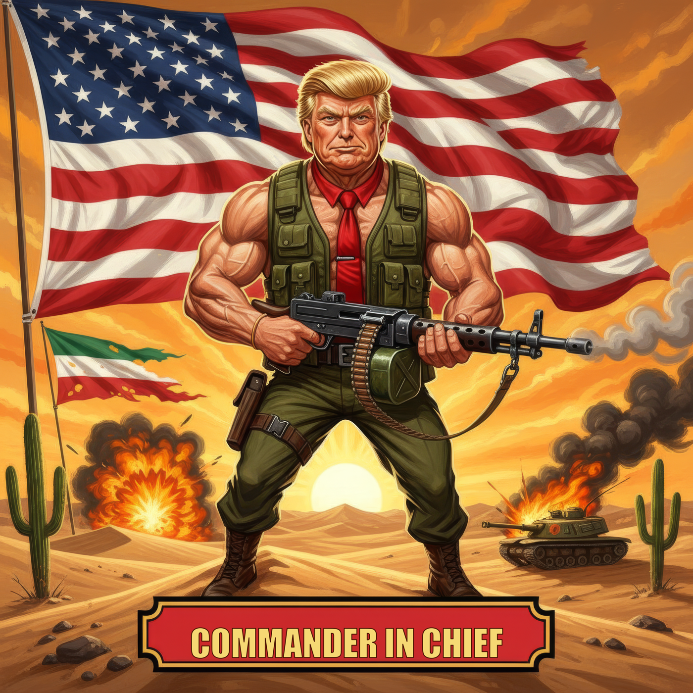
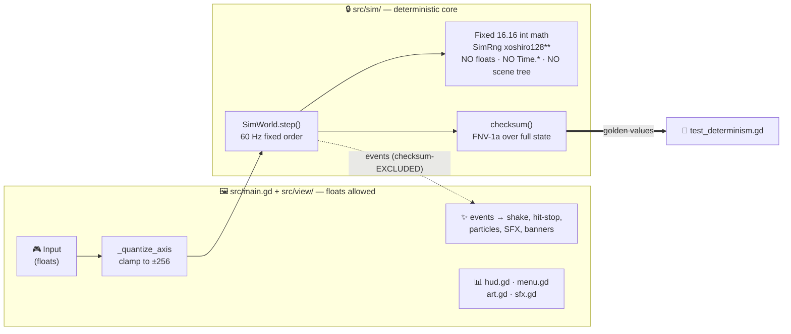
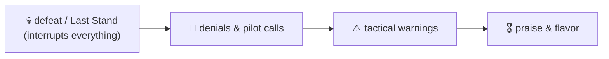
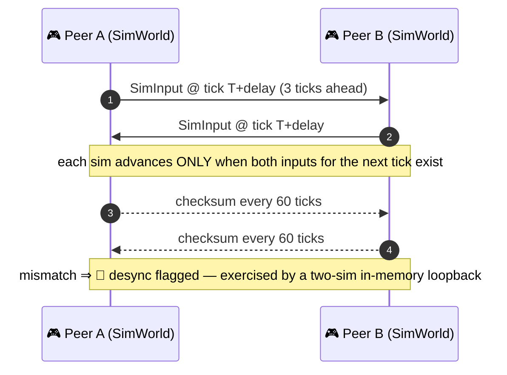
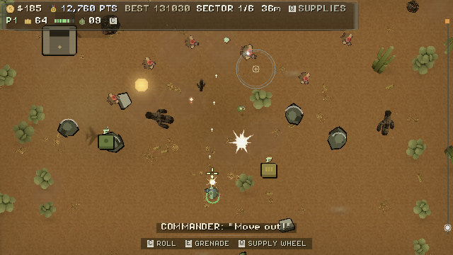
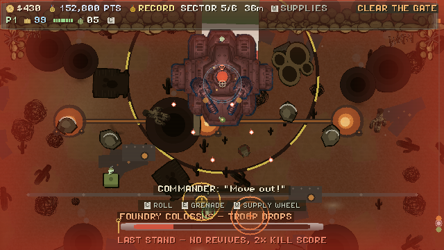
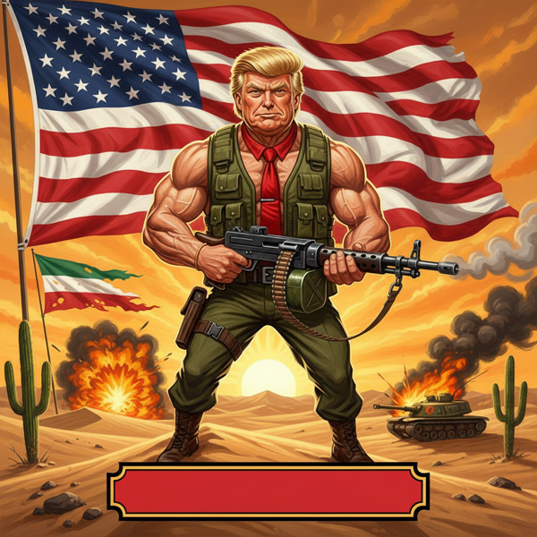
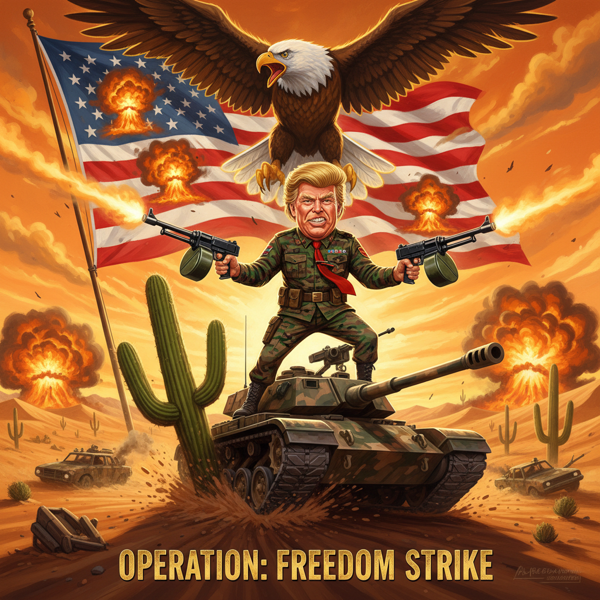

# ⚔️ COMMANDER IN CHIEF

<div align="center">

```
 ██▓ ██ ▄█▀ ▄▄▄       ██▀███   ██▓
▓██▒ ██▄█▒ ▒████▄    ▓██ ▒ ██▒▓██▒
▒██▒▓███▄░ ▒██  ▀█▄  ▓██ ░▄█ ▒▒██▒
░██░▓██ █▄ ░██▄▄▄▄██ ▒██▀▀█▄  ░██░
░██░▒██▒ █▄ ▓█   ▓██▒░██▓ ▒██▒░██░
░▓  ▒ ▒▒ ▓▒ ▒▒   ▓▒█░░ ▒▓ ░▒▓░░▓
 ▒ ░░ ░▒ ▒░  ▒   ▒▒ ░  ░▒ ░ ▒░ ▒ ░
```




**A modern remake of the 1986 vertical run-and-gun** (*Ikari Warriors*, SNK) —
twin-stick chaos, grenades-vs-armor, one-hit deaths, and the **War Chest 💰**:
a shared coin economy where every kill mints and every revive spends.

### 🎬 Gameplay demo


<sub>☝️ **Live in-engine capture** (movie-mode render, seed 18) — one-hit twin-stick, threat callouts, the corner War Chest economy. Not a mockup.</sub>

</div>

> ⚠️ **Status: P3, playable start→finish.** Campaign runs studio splash → Foundry
> Colossus 🏭, Endless War is deep, all side modes ship (Boss Rush · Arcade · Chapter
> Select · Daily Run), and the feel stack is real. Art is **owned procedural art
> (`tools/gen_*.py`) + bespoke generated boss/vehicle/desert pieces** over a Kenney-CC0
> FX base — no longer greybox, and no longer legacy art-derived (every encumbered sprite was
> replaced; see [`OPEN_SOURCE_CHECKLIST.md`](OPEN_SOURCE_CHECKLIST.md)).
> **CI is live**: `.github/workflows/ci.yml` runs a static `lint` job (`tools/lint_sim.gd`
> determinism gate + `tools/lint_assets.gd`), then import + boot-smoke + the full
> golden-checksum suite (**693 methods / ~14.7k assertions** — the runner prints the exact
> pair) across **Linux-x86_64 · macOS-arm64 · Windows-x86_64**, failing on any
> `SCRIPT ERROR` or a missing `PASS` line — plus packaged-export smoke tests on Linux and
> Windows, an advisory (`continue-on-error`) perf job, and a nightly 3-hour soak run.
> The engine version is pinned in `tools/versions.lock`, the one source CI reads, so the
> build can't drift from what the determinism goldens were recorded against.
> `docs/PLAN.md` is the aspirational P0–P7 master plan — **the sim code is the
> source of truth for what exists.**

---

## 🗺️ Table of Contents

| 🧭 | | |
|---|---|---|
| [🏗️ Architecture](#%EF%B8%8F-architecture--the-simview-split) | [🎮 Controls](#-controls) | [🕹️ Modes](#%EF%B8%8F-modes) |
| [👹 The Roster](#-the-roster) | [🎁 Drops & the Wheel](#-drops--the-supply-wheel) | [🧪 Testing](#-headless-test-suite) |
| [📻 The Radio](#-the-radio) | [🌐 Netcode](#-netcode-deterministic-lockstep) | [🚀 Quick Start](#-quick-start-macos--apple-silicon) |
| [🎨 Art](#-art) | | |

---

## 🏗️ Architecture — the sim/view split

Everything the game *is* lives in a deterministic, render-free core. The scene tree
is just a camera pointed at it. 📽️



- **`src/sim/`** — `SimWorld.step(inputs)` advances one tick: players → tanks →
  projectiles → enemies → bunkers → spawner/boss/colossus/gates/camera/observer.
  State is plain `Array[Dictionary]`. Bit-identical across x86_64 and Apple Silicon.
- **`src/main.gd` + `src/view/`** — the *only* view. Owns all floats, reads sim
  state, draws, and turns per-tick **events** into feel. The sim never knows juice exists.
- **`SimWorld.events`** — rebuilt every tick, **excluded from the checksum**: view
  and audio triggers never break determinism goldens. 🔓

<details>
<summary>🔐 <b>The golden-checksum discipline</b> (read before touching <code>src/sim/</code>)</summary>

Any change to sim logic, hashed state, or step order shifts the committed `GOLDEN`
checksums and fails `test_determinism.gd` — **by design**. When intentional:
set `GOLDEN = []`, run, paste the printed values back, note *why* in the comment.
`test_checksum_coverage.gd` is the tripwire — every sim entity field must be
classified hashed-or-excluded. If the **idempotency or cross-run** checks fail
instead, that's real non-determinism: **fix it, never re-record over it.** 🚨

</details>

---

## 🎮 Controls

| Action | ⌨️ Keyboard (P1) | 🎮 Gamepad |
|---|---|---|
| Move | WASD | Left stick |
| Aim (decoupled) | Mouse or arrow keys | Right stick |
| Fire / tank cannon 🔫 | Space / LMB | RT / R1 |
| Grenade 💣 — **hold through the apex = AIRBURST** 🎈 | Shift / RMB | L1 |
| Dodge roll (i-frames) 🤸 | C | B |
| Interact 🚜 (board/exit tank · **gunner seat** on an occupied hull · **salvage hulks** · plant claymores) | F | X |
| Revive (spend War Chest) 💸 | E | Y |
| **Supply wheel** (hold, flick, release) 🎡 | Q | BACK |
| Toggle local 2P 👥 | F2 | — |
| Toggle Endless War ♾️ | F3 | — |
| Restart 🔁 | R | — |

---

## 🕹️ Modes

| Mode | What it is |
|---|---|
| 🏔️ **Campaign** | 6 gated sectors (`SimWorld.FINAL_GATE_INDEX`) → the **Foundry Colossus** finale (Last Stand rule: no revives; kill converts your War Chest to score. **VICTOLY!**). Gates 2 & 4 **fork**: `< CACHE` (free crate ringed by mines) vs `BOUNTY >` (two elites, one marked) — walking a side IS the choice 🛣️ |
| ♾️ **Endless War** | Escalating waves, between-wave **shop intermissions**, minibosses that **fly in** over 7s and **escalate by tier** (tighter spray, extra mortars by w15), contested **parachute supply drops** rushers try to steal 🪂, and the wave-7+ **Broadcast Tower** debut |
| 👥 **Local 2P co-op** | Shared War Chest, revive tether, per-device input glyphs |
| 📅 **Daily Run** | Seed-of-the-day challenge run (Hall entries wear a `*DAILY` tag) |
| 🎞️ **Watch Last Run** | Every run records inputs → `user://last_run.replay`, replayable from the menu |
| 💀 **NG+ HARD** / 🛟 **ASSIST (2-hit)** | Difficulty toggles, both checksum-honest |

Persistent carrots 🥕: top-8 **Hall of Fame**, career totals, and best score/wave/distance
survive across runs (`user://ikari_best.cfg`, atomic tmp+bak writes).

---

## 👹 The Roster

Every threat telegraphs before it resolves — that's the **readable chaos** pillar. 📖

| Threat | The deal | The counter |
|---|---|---|
| 🏃 Rushers & red elites | The 1986 grammar — touch = death, elites drop capsules | Shoot, dodge, kite |
| 💥 Grenadier | Telegraphed lob, edge-detect markers | Move off your ground |
| 🔭 Sniper | Laser paint line before the shot | Break the line |
| 🌿 Ghillie sniper | Cloaked ambush, bullet-immune dug in | Flush it out |
| 🛡️ Riot shield | Front-arc bullet block | Flank, grenade, or **Rend** through it |
| 🧨 Sapper | Lays a live mine trail | Mind your feet |
| 🏅 Courier | Flees with a fat bounty (4× elite) | Cut it off |
| 🐸 Frogman | Submerged in rivers, grenades-only until it surfaces to lunge | Kill it on the surface |
| 🛸 Drone | Hovering strafer, spawns **marked** (3× trophy bounty + crown) | Watch the tether, claim the crown |
| 🔩 MG Nest | 3-hit armor, alarm lock-on, teaching card | Break its line or flank — it cracks under fire |
| 📡 **Broadcast Tower** | Rooted rally mast (endless w7+): every ground trooper in its 140px aura runs **+25%**, and it holds the wave open | Kill the mast, break the rally — 5 hits or one grenade |
| 🚙 **Technical** | *The fastest thing on the field.* Cruises, revs 30t (dashed line = still aiming), then **locks a charge lane** (solid line = committed) — 3 px/t, can't steer | Sidestep the lane; one shot drops it; smoke denies the lock; water kills the charge 🌊 |
| 🛢️ Explosive barrels | Bullets & enemy contact detonate; 8-tick chain fuse goes white-hot | Feed the chain — or flee it |
| 🗼 Mortar Observer | Shells you for stalling | Kill him or push forward |
| 🚁 Bridge Gunship | Gate boss every 3rd gate — bullets chip, grenades chunk. Chin-turret **charge glow** telegraphs each spray; mortars **lead your walk** while the hull keeps drifting | When it dies, see below 👇 |
| 🪂 **Downed Pilot** | Ejects from any dead gunship, staggers for the enemy line. **TOUCH to rescue (+100¢). Shooting him pays NOTHING.** Tank treads *grab* him, the airstrike spares him, roll-touch works | Reach him before the top edge — the label turns red **ESCAPING!** at the cliff |
| 🏭 Foundry Colossus | The world ends here: 3 phases, pure armor, inverts the scroll | Grenades only. Last Stand. 🫡 |

---

## 🎁 Drops & the Supply Wheel

**Rare capsules** (elite drops, weighted table): 🔵 PIERCE · 🟠 SPREAD · 🩷 TRIPLE
(permanent 3-fan — stacks with Spread into a 5-fan!) · 🔴 REND (shears riot shields) ·
🟢 CLAYMORE · ⚪ SMOKE (breaks locks) · 🟡 FLASHBANG (field-wide stun, fair re-arm).

**The wheel** 🎡 went **8-way** (hold Q / BACK, flick, release — coin prices from the shared War Chest):

| Direction | Buy | Effect |
|---|---|---|
| ⬅️ | AMMO +30 | MG belt top-up |
| ⬆️ | GRENADES +4 | The armor-opener |
| ➡️ | FLAK VEST | Absorbs exactly one hit 🦺 — **campaign price creeps** 60→75→90→105→120¢ per buy |
| ⬇️ | AIRSTRIKE | **Called in**, telegraphed, spares the submerged *and the pilot* ✈️ |
| ↙️ | SANDBAGS 40¢ | Plants a **36×10 cover segment** along your aim 🧱 — blocks bullets & rusher pathing both ways, dies to one grenade or tank treads, field cap 6 |
| ↗️ | SUPPLY CALL ★1 | Spends a **Commendation** (never coins) for a free useful supply 🎖️ |

### 🎖️ Commendations & field-craft

- **Commendation tokens** ★ — minted by *play*, never bought: the 20-kill surge and every
  flawless gate pay one (cap 2). A death burns one. Spend on the wheel's ↗️ socket —
  the score→power bridge the panel voted 9/9 for.
- **Tank Crew** 👥🚜 — P2 can INTERACT an *occupied* tank: independent twin-stick **coax
  gunner** seat on his own ammo, +25% fuel tax, driver exit promotes the gunner, the bail
  window covers the whole crew.
- **Tank Hulks** 🛢️ — dead hulls smolder as **two-way bullet cover** for ~17s; INTERACT
  salvages **+2 grenades** and strips the cover. Keep the wall or take the ammo.
- **Airburst** 💣🎈 — keep holding the grenade button *since the throw* and the charge pops
  at the arc's apex: tap for range, hold for the pop.

---

## 📻 The Radio

A single radio-filtered **Commander** (with a Spotter on the second channel and one
panicked Pilot) barks the big beats — 14 lines, ≤8 words each, priority-laddered so the
radio never talks over itself and never wears out on the hundredth replay:



| Voice | Owns | Filter |
|---|---|---|
| 🎖️ **Radio Commander** | *"War Chest empty. You're on your own."* · *"Overlord out."* · Last Stand · **VICTOLY!** | 1.1 kHz bandpass + overdrive — tactical radio |
| 🎯 **Spotter** | Pilot down · shop locked · *"Clip dry! Bash 'em!"* | Lighter, crisp |
| 🪂 **Downed Pilot** | *"Don't shoot! I'm worth a hundred coins!"* (0.4s behind the callout) | Dry close-mic — he's HERE |

Concussion muffles the radio too — by intent. A stunned soldier hears underwater radio. 🌊

---

## 🧪 Headless test suite

```sh
godot --headless --path . --import                      # once after cloning / new class_name scripts
godot --headless --path . -s res://tests/run_tests.gd   # full suite
SUITE=mechanics godot --headless --path . -s res://tests/run_tests.gd   # filter by suite name 🎯
SUITE=perf godot --headless --path . -s res://tests/run_tests.gd        # opt-in timing suite ⏱️
```

**693 test methods / ~14.7k assertions** (the `PASS —` line prints the exact pair) — fixed-point
math, seeded RNG streams, the 1986 mechanic grammar, the War Chest economy,
tank/observer/gates/water/gunship/colossus, every archetype's behavior contract (nest armor,
technical charge lock, pilot rescue/grace/forfeit), Endless War waves & shop, lockstep loopback,
replay integrity, checksum coverage classification, and the campaign+endless **golden
determinism** runs.

`test_perf.gd` asserts wall-clock microseconds, so it sits in `run_tests.gd`'s `OPT_IN_SUITES`:
the default full run **skips** it (that's why the method count above is 693, not 695), and CI
runs it in an advisory `continue-on-error` job. A shared runner is a noisy neighbour and a
randomly-red gate stops being read.

> 🧷 Gotcha: the runner counts a method green even if a runtime error aborts it
> mid-way — watch for `SCRIPT ERROR` lines, and hold dict references across
> `sim.step()` (dead entities are swept from the arrays).

---

## 🌐 Netcode: deterministic lockstep — **a design sketch, not shipped online play**

> ⚠️ **Read this before believing the diagram.** `src/net/lockstep.gd` has **zero production
> callers** — nothing in `src/main.gd` or the menus constructs a `LockstepSession`, and no
> transport is wired to `on_send`. Online co-op is **not playable**. What exists is a 108-line
> loop plus `tests/test_lockstep.gd`, whose `FakeWire` is a deterministic **in-memory** wire with
> latency jitter only: it never drops, duplicates, corrupts-by-network, disconnects, or times out
> a packet (the one corruption test flips a payload byte by hand to prove the checksum exchange
> notices). So the test proves the *sim* is deterministic enough for lockstep and that the loop's
> stall/catch-up/desync-flag logic is self-consistent — it proves **nothing** about behavior on a
> real lossy network. Treat the section below as the intended design. 🎯

`src/net/lockstep.gd` — transport-agnostic; only encoded inputs cross the wire. 📡



Steam Networking Messages is *meant* to plug into `on_send` / `receive_remote_input` without
touching the loop — that transport has not been written, so the seam is untested against a real
socket. Per `docs/PLAN.md` online 2P is a post-launch beat, not a launch promise; local 2P and
Remote Play Together are the co-op that actually ships.

---

## 🚀 Quick Start (macOS / Apple Silicon)

1. Grab **Godot 4.7 (stable)** `macos.universal.zip` from
   <https://godotengine.org/download/archive/4.7-stable/> — native on M1–M4. 🍎
2. Run it:
   ```sh
   /Applications/Godot.app/Contents/MacOS/Godot --path /path/to/commander-in-chief
   ```
   …or open the editor, **Import** → `project.godot` → ⌘R.
3. Gatekeeper complains? Right-click → Open once, or
   `xattr -dr com.apple.quarantine Godot.app`. 🔓

Determinism across architectures is by construction (pure 64-bit int math) and
asserted by the golden suite — run it locally on your arch; the values must match
the committed goldens recorded on Apple Silicon. 🤝

---

## 📁 Layout

```
project.godot        Godot 4.7 project (640×360 virtual res, 60 Hz physics)
src/sim/             🔒 Deterministic core — int-only, no engine RNG, no Time.*
src/main.gd|.tscn    🖼️ The view + input quantization boundary
src/view/            art.gd (bake registry/tint/glyphs) · hud.gd · menu.gd · sfx.gd
src/net/             replay.gd (run recorder, live) · lockstep.gd (design sketch, no callers)
tests/               Headless runner + 33 suites (SUITE=<name> filter, golden checksums)
tools/               gen_*.py (the live sprite generators) · lint_sim.gd/lint_assets.gd (CI gates)
                     screenshots.gd · smoke.gd · validate_replay.gd · purge_history.sh
                     bake_sprites*.gd — LEGACY: needs the legacy art source project, nothing ships from it
docs/PLAN.md         📜 The aspirational P0–P7 master plan
```

---

## 🎨 Art

<table>
<tr>
<td width="50%"></td>
<td width="50%"></td>
</tr>
<tr>
<td align="center"><sub>Desert firefight — one-hit twin-stick</sub></td>
<td align="center"><sub>The Foundry Colossus 🏭 — campaign finale</sub></td>
</tr>
</table>

The art is a **hybrid pipeline**, not one source:

| Layer | Source | Where |
|---|---|---|
| Units · structures · props | ✅ **Owned procedural art** (`tools/gen_entities.py`) | `assets/art/{decor,p2,mil2,cast2}` + 7 top-level |
| Player + enemy soldier sprites | ✅ **Owned procedural art** (`tools/gen_entities.py`) | `assets/soldiers/` |
| Menus · HUD · icons · FX cards | ✅ **Owned procedural art** (`tools/gen_ui_chrome.py` · `gen_ui_icons.py` · `gen_ui_glyphs.py` · `gen_fx_cards.py`) | `assets/art/{ui,hud,icons,fx}` |
| Bosses · player tank · desert flora | **Bespoke generative-AI art** (fal.ai + Replicate; `nano-banana` for the desert cactus) — the gunship/colossus/tank silhouettes and painterly props | `assets/art/` (owned, gen-AI) |
| Ground · projectiles · FX | **Kenney CC0** | `assets/kenney/` |
| Radio VO (56 mp3) | **speech synthesis** — redistribution cleared 2026-07-24 | `assets/vo/` |
| Combat shouts (118 mp3) | **speech synthesis** stock voices (ar/fa lines) | `assets/audio/` |
| Text | **PixelOperator8** — CC0, Jayvee Enaguas | `assets/fonts/` |

The desert→jungle look is a per-sprite olive tint + 1px readability outline applied in the
view (`src/view/art.gd`), not baked in — so a new asset joins one palette family regardless
of which source it came from.

> ✅ **Every asset is now cleared.** All 266 PNGs under `assets/` are owned procedural art
> (`tools/gen_*.py`), owned generative-AI pieces, or CC0 (Kenney), and the 174 speech synthesis mp3
> were cleared for redistribution with speech synthesis on 2026-07-24. One step remains before going
> public: purge the old proprietary art from git history — `tools/purge_history.sh`. Full map: [`ASSETS.md`](ASSETS.md). Generative-AI assets **are** sanctioned (the earlier no-AI policy
> was dropped — see `CLAUDE.md`); the gen-AI boss/vehicle/desert art and the speech synthesis VO
> already ship in-game. 📋 Full asset-licensing map + the path to a public release:
> **[`OPEN_SOURCE_CHECKLIST.md`](OPEN_SOURCE_CHECKLIST.md)**.

<details><summary>🖼️ <b>Promo / key-art variants</b></summary>

<table>
<tr>
<td width="50%"></td>
<td width="50%"></td>
</tr>
</table>

<sub>Marketing key-art variants (generative-AI). Full 4K titled poster lives in the asset drop, not the repo.</sub>
</details>

Accessibility baked into the view 🧏: colorblind-safe palette routing (`Art.safe`),
reduce-motion mode (steady lights instead of strobes/pulses), photosensitivity
discipline (no kill-flash spam), SFX/music/rumble toggles, device-adaptive glyphs.

---

<div align="center">

**⚔️ VICTOLY awaits. Feed the War Chest. Rescue the pilot. Sidestep the lane. ⚔️**

*Built at 60 Hz. Bit-identical everywhere. The sim never knows juice exists.* ✨

</div>
