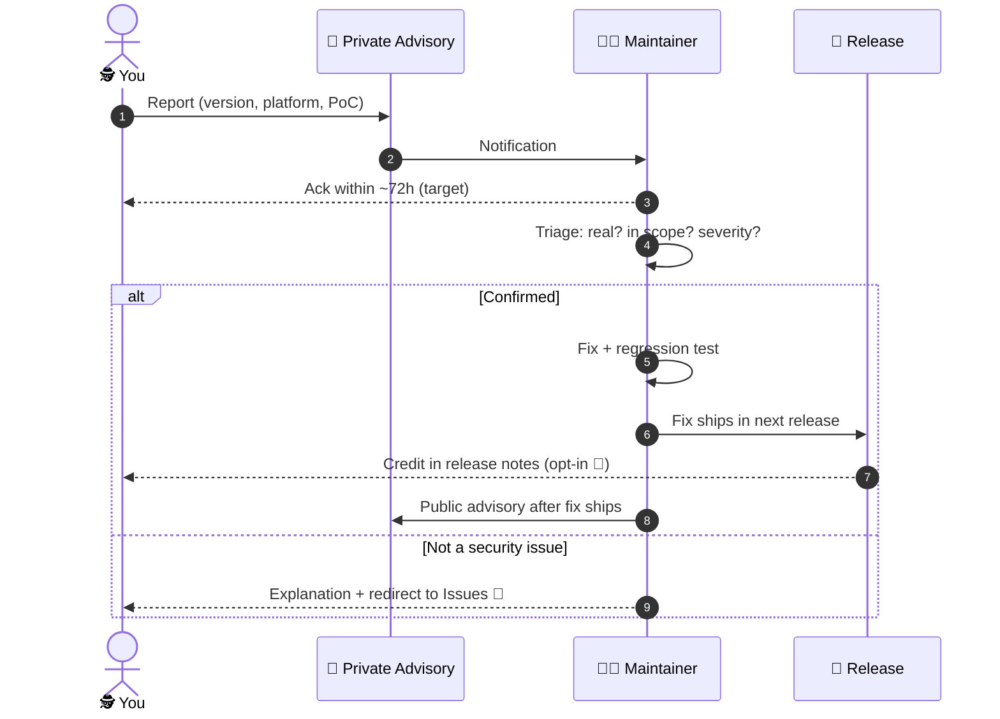

# 🛡️ Security Policy

**Commander In Chief** is an offline single-player / local-co-op Godot game. There are no
servers, no accounts, no telemetry, and no shipped network play — the attack surface is
roughly the size of a grenade pin. 🫣 We still take that pin seriously. If you find a way to
make this game do something it shouldn't, we want to hear about it.

---

## 🪖 Supported Versions

| 🏷️ Version | 📦 Status |
|---|---|
| `main` branch | ✅ Actively maintained — fixes land here first |
| Latest release (`v0.3.x`) | ✅ Supported — macOS · Linux · Windows binaries |
| Anything older (`v0.2.x` and below) | ⚠️ Best effort — please reproduce on the latest release before reporting |

> 🔍 Not sure what you're running? Check the
> [latest release](https://github.com/shoemoney/commander-in-chief/releases/latest) first —
> half of all "vulnerabilities" in older builds are bugs we already shot dead. 💀

---

## 🎯 In Scope

The honest list of places hostile input can actually reach this game:

| 🎯 Surface | 📍 Where | 💣 What we're worried about |
|---|---|---|
| **Save / config parsing** | `user://ikari_best.cfg` (+ `.tmp` / `.bak` rotation) via `ConfigFile` in `src/main.gd` | A crafted save file crashing the game, corrupting the merge path, or smuggling hostile values past the clamping (`_cfg_int` & friends) |
| **Replay parsing** | `user://last_run.replay` via `Replay.load_from` (`src/net/replay.gd`, magic `IKARI_REPLAY_1`) | A hand-built replay file that breaks the parser, desyncs validation, or claims a score the recorded inputs can't reproduce |
| **Lockstep desync / checksum logic** | `src/net/lockstep.gd` | Input-validation or desync-detection flaws. ⚠️ **This is a design sketch with zero production callers** — no shipped build opens a socket. Reports welcome, but the exploit has to live in the *logic*, not in a network you had to build yourself |
| **Asset pipeline tooling** | `tools/gen_*.py` (entities · UI chrome · icons · glyphs · FX cards) | Code execution or path tricks when a maintainer runs the generators against untrusted input (e.g. a hostile PR) |
| **Export / binary integrity** | GitHub Releases artifacts (`export_presets.cfg`, CI export-smoke) | Tampered release zips, or a build pipeline weakness. Note: macOS builds are **ad-hoc signed, not notarized** — that's a known position, not a finding |

## 🚫 Out of Scope

| 🚫 | Why |
|---|---|
| 🌐 "Hacking the online multiplayer" | There is none shipped. No ENet, no `HTTPRequest`, no sockets in any shipped runtime path — `SteamBridge` (`src/steam/steam_bridge.gd`) no-ops offline because GodotSteam isn't bundled |
| 👤 Accounts, servers, PII, telemetry | None exist. The game writes a config file and a replay to `user://` and that's the whole data footprint |
| 🎭 Asset provenance & legal questions | The VO likeness position and third-party components live in [`NOTICE.md`](NOTICE.md) and [`ASSETS.md`](ASSETS.md) — that's a licensing conversation, not a security report |
| 🐛 Plain gameplay bugs | Those go in [Issues](https://github.com/shoemoney/commander-in-chief/issues) or [`FINDINGS.md`](FINDINGS.md) — a crash you cause with a normal controller is a bug, not a vulnerability |
| 🔓 Jailbreak/root-required "attacks" | If you already own the machine the game runs on, the save file was always yours to edit |

---

## 📮 How to Report

| 🥇 Primary | 🥈 Fallback |
|---|---|
| **[GitHub Private Vulnerability Reporting](https://github.com/shoemoney/commander-in-chief/security/advisories/new)** — draft a private advisory on this repo | 📧 **jeremy@shoemoney.com** |

Please include: the version/commit you tested, the platform, what you did, what happened,
and (if you have one) a crafted `ikari_best.cfg` / `.replay` / PoC that reproduces it.
Replays and saves attach beautifully to a private advisory. 📎

---

## ⏱️ Response Expectations

Honest version: this is a **solo-maintainer, best-effort** project, not a SOC. 🪖

| 📌 Step | 🎯 Target | 🗒️ Reality check |
|---|---|---|
| Acknowledge your report | **~72 hours** | Usually faster; weekends exist |
| Triage verdict (real / not / needs info) | ~1 week | Crafted-file PoCs triage fastest |
| Fix for confirmed issues | Next release when possible | Severity and blast radius decide; a parser crash beats a theoretical desync |
| Public advisory | After the fix ships | Coordinated disclosure, credit opt-in 🏅 |

If the ack window blows past, one polite nudge by email is welcome — silence means life
happened, not that your report was ignored. 💤

---

## 🙏 Safe Harbor

Good-faith security research is welcome here. Specifically, we won't come after you for:

- 🔬 Testing against **your own install** of the game, saves, replays, and tools
- 🧪 Fuzzing the `ConfigFile` / replay parsers as hard as you like
- 📤 Reporting through the channels above and giving us a reasonable window before disclosure

In return, please:

- 🚷 Don't test against other people's machines or saves
- 🧨 Don't destroy or exfiltrate data that isn't yours (there's barely any here — keep it that way)
- 🤫 Don't public-disclose before the fix has had a fair shot at shipping

---

**⚔️ Found something? Report it, and the War Chest owes you one. ⚔️**

*Bit-identical everywhere — including the bugs, until you tell us about them.* ✨

